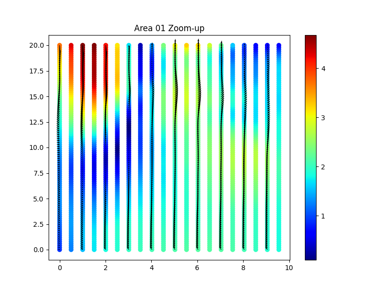

# osaka-bay-ai-pinn
Physics-Informed Neural Networks (PINNs) for Osaka Bay Tidal Flow Estimation using STOC LST data.
# Osaka Bay Flow Estimation using PINNs
海洋数値モデル（STOC）の結果とAI（物理情報ニューラルネットワーク）を融合させた、大阪湾の流速推定プロジェクトです。

## 🛠 実装内容
- **データ抽出**: Fortranを用いて、5.6GBのバイナリ（LSTファイル）から特定海域（Area 01）の流速・座標データを高速に抽出。
- **AIモデル**: 物理情報ニューラルネットワーク（PINNs）を実装。ナビエ・ストークス方程式等の物理法則を損失関数に組み込み、データ不足領域の補完精度を向上。
- **可視化**: Python (Matplotlib) を用いて、推定された潮汐流のベクトル図を生成。

## 📊 成果物（Area 01の推定結果）

*AIによって推定・可視化された大阪湾奥部の流速分布*
